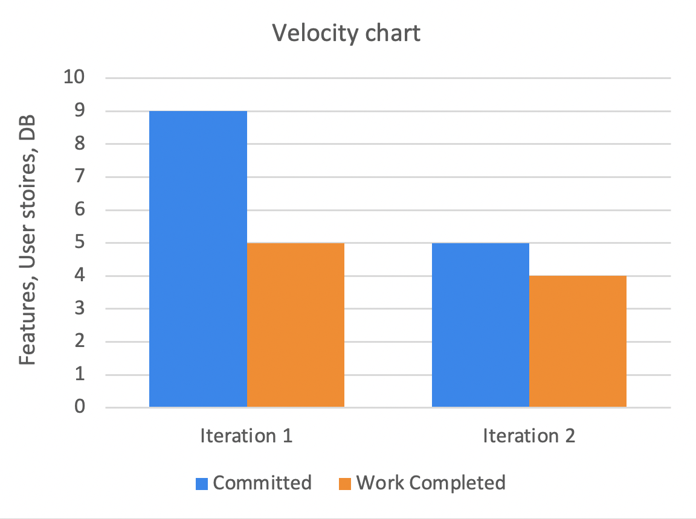

## Retrospective from iteration 2
There are several factors which allowed us to work efficiently and to complete the requirements of iteration two of our project. Proactive task delegation and planning made the process much more streamlined, reducing the risk of overshooting our release deadline. Also, having developed initial insights from iteration one, we as a team were much more aware of our own work velocity, consequently setting more realistic and achievable goals for the iteration. Transitioning from our first iteration, we were able to build stronger foundations for our true vision of this application which in turn made it easier to narrow our focus down on the features that we truly needed in line with our developing visions and the ones that were obsolete as a result of this progression. To reduce further uncertainty, we decided to have more frequent team meetings to check up on our progress and make sure all the delegated tasks were being met as planned. Crediting the factors mentioned, the team was able to work more effortlessly and harmoniously as a collective, have efficient communication and following through with the time estimates of delegated tasks.

As expected, we also experienced some minor shortcomings for iteration two. There were some solid violations in our code that needed to be refactored and we had issues with the integration tests not being complete due to not having a working real database in place to support the tests. 
 
In iteration three, we plan on rectifying our shortcomings by focusing on the following aspects: 
Completing any incompleted tasks from the previous iteration before moving on to the newer tasks, taking the feedback we got from iteration two and integrating the feedback as part of our project, learning to not only be in accordance to the solid principles individually but working as a team to better integrate the solid principles in our project since as a team we are better at avoiding code smells. We plan on doing this by having each team member go over the complete implementation, not just their delegated tasks, increasing the odds of catching code smells and reducing technical debt.

To analyze and reflect on the completion of iteration three in accordance to the improvement suggestions above, we have set the following criteria; Having a fully functional database, number of issues that are closed from the current iteration, ensuring each member has reviewed the code, having a stable functioning application that has all our planned features implemented and all other iteration requirements are met

## Velocity for iteration 1 & 2

