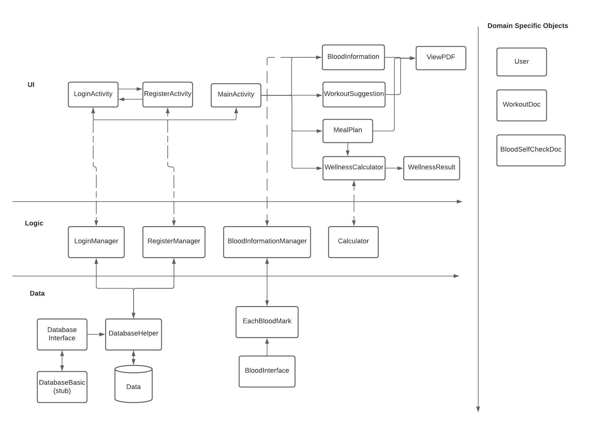

# **GROUP 3 - THRIVE ARCHITECTURE**

## Diagram

### UI/Presentation Layer
- LoginActivity : UI for user login.
- RegisterActivity : UI for user register.
- MainActivity : The main dashboard of the app where each card navigates to each of the features.
- WorkoutSuggestion : Feature UI for workout suggestions to users.
- BloodInformation : Feature UI for providing general information about some of the main blood markers, possible symptoms when it is out of the normal range, and suggestions that users can look up.
- MealPlan : Feature UI for providing meal plans based on the users' maintenance calories and dietary preference (vegetarian or non-vegetarian).
- WellnessCalculator : Feature UI for users to see their current BMI and calorie intake to maintain their weight.
- WellnessResult : Result from the wellness calculator.
- ViewPDF : Class to show documents from the WorkoutDoc & BloodSelfCheckDoc objects.
---
### Logic
- LoginManager : Checks credentials from the data layer to proceed login.
- RegisterManager : Checks for the valid inputs and proceeds register from UI to Data.
- BloodInformationManager : Brings data from the data layer to the UI.
- Calculator : Calculates wellness.
---
### Data/Persistence
- Database (Interface)
- DatabaseBasic (stub)
- DatabaseHelper (adapter)
- IBlood (interface)
- Each of the bloodmark classes that extend IBlood : includes general information and symptoms associated.
---
### Domain Specific Objects
- User
- WorkoutDoc
- BloodSelfCheckDoc
