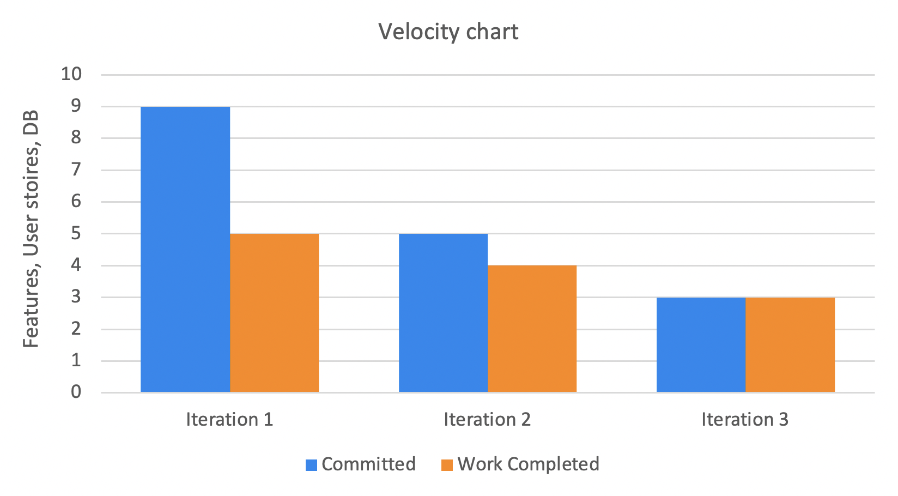

What technical debt has been cleaned up
========================================
In order to avoid technical debt in the future when adding multiple languages to the application, we removed all the hardcoded texts into the resource file. This makes code manageable as well since we do not have to open all the separate files to edit the texts. This was an inadvertent, reckless technical debt.
[link to commit](https://code.cs.umanitoba.ca/3350-winter-2021-a02/thrive/-/commit/1aa3b456ca9852a8490422c3dad52347f438aa4d)

What technical debt did you leave?
==================================

What one item would you like to fix, and can't? Anything you write will not
be marked negatively. Classify this debt.

Discuss a Feature or User Story that was cut/re-prioritized
============================================
The Blood Health Optimizer was re-prioritized in our iteration 2 when we realized we would not be able to finish it in one iteration. Since this feature had two parts, one informative and one evaluation with user-entered data, we decided to split the feature in half and finish the first part and move the second part to the next iteration. However, we realized there were more refactoring and testings to do before moving on. Therefore, the second part of the feature has been reassigned to iteration FUTURE. 

[link to the re-prioritized feature](https://code.cs.umanitoba.ca/3350-winter-2021-a02/thrive/-/issues/2)

[link to the first part of the feature that was completed](https://code.cs.umanitoba.ca/3350-winter-2021-a02/thrive/-/issues/22)

Acceptance test/end-to-end
==========================

Write a discussion about an end-to-end test that you wrote. What did you test,
how did you set up the test so it was not flaky? Provide a link to that test.

Acceptance test, untestable
===============

What challenges did you face when creating acceptance tests? What was difficult
or impossible to test?

Velocity/teamwork
=================
Our estimates got better through the course as shown below.
Our unit of measurement was the sum of the number of features, number of user stories, and implementation of the database. We learned from our completed work from iteration 1 and anticipated to complete 5 "works." We struggled with implementing the database in iteration 2, but other than that, we were very close to our estimation. Since we almost finished what we had planned for iteration 2, we thought 5 "works" are the right amount of work we can do for one iteraiton. However, the reason the committed work in iteration 3 was less than 5 was because the chart does not include other parts of the project such as refactoring and project presentation which we had to take into account when planning for handing all of them on the same day.

